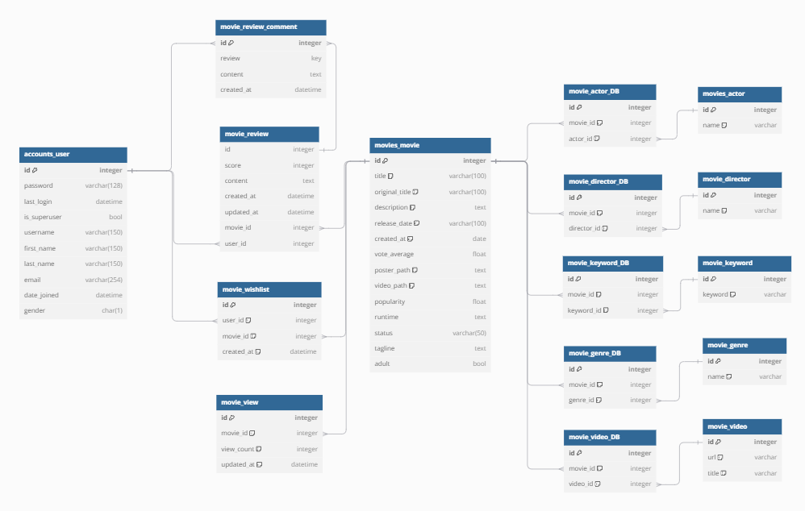

# 키키무비 (KikiMovie) 프로젝트
## 1. 프로젝트 개요
**키키무비**는 사용자들에게 재미있고 개인화된 영화 추천 경험을 제공하기 위해 기획되었습니다. TMDB와 KOFIC API를 활용하여 실시간 영화 데이터를 기반으로, 간편하고 유쾌한 추천 서비스를 목표로 하고 있습니다. 특히, AI 기술을 활용해 닮은꼴 배우와 영화 추천을 접목한 차별화된 기능을 제공하고자 합니다.

## 2. 팀원 정보 및 업무 분담 내역
| 팀원  | 역할 및 담당 업무 |
|-------|------------------|
| **박희원** | - 사용자 프로필 (내가 본 영화, 보고싶은 영화 관리)  - 영화 정보 DB 구축 (API 연동)  - 영화 상세 페이지 구현  - 메인 페이지 개발 |
| **김민지** | - 사용자 인증 (회원가입, 로그인, 개인정보 수정)  - 이메일 인증 및 소셜 로그인  - 영화 리뷰 기능 (좋아요, 댓글) |

---
## 3. 목표 서비스 구현 및 실제 구현 정도
- 실제 구현률 70%
    - 데이터 연동 부분과 회원가입 폼 커스텀하는 부분에서 시간이 딜레이됨

## 4. 프로젝트 진행 일정
| 날짜            | 일정                              |
|-----------------|-----------------------------------|
| 11월 18일(월)   | 기획서 초안 작성, 화면설계서 구체화(Figma), API 선택 |
| 11월 19일(화)   | ERD 설계, 사용자 인증(회원가입/정보수정), 영화정보 DB 구축 |
| 11월 20일(수)   | 사용자 인증(로그인/로그아웃), 영화 정보 DB 구축 |
| 11월 21일(목)   | 영화 리뷰(좋아요, 댓글) 기능 개발, 영화 상세 페이지 개발 |
| 11월 22일(금)   | 사용자 프로필 페이지 구현, 영화 상세 페이지 데이터 연동 |
| 11월 23일(토)   | 영화 상세 페이지 구현, 영화 추천 알고리즘 개발 |
| 11월 24일(일)   | 사용자 정보 수정 기능 구현, 리뷰, 댓글 기능 구현 |
| 11월 25일(월)   | 인공지능 연동 알고리즘 보완, 디자인 |
| 11월 26일(화)   | 인공지능 연동, 발표 준비 |
| 11월 27일(수)   | 프로젝트 발표 |

---
## 5. 화면 설계

## 6. 데이터베이스 모델링

## 7. 영화 추천 서비스

- 랜덤으로 움직이는 박스를 메인으로 두어 '재미'요소 강조

### 1.알고리즘
#### 1. 박스오피스
- TBMD, KOFIC API를 조합해 박스오피스 상위 랭킹 1 ~ 10위에 해당하는 영화 추천

#### 2. 돌림판
- Vur의 roulette 라이브러리 사용
- TMDB API 영화정보를 통해 랜덤으로 영화 추천 
- 영화 줄거리 특정 단어 필터링 적용하여 성인영화 채택 시 경고문구 팝업

#### 3. 나와 닮은 배우 출연 영화
- 생성형 AI에게 TMDB에 있는 인기 한국 배우 50명 이름 추천 받아 각 배우당 학습데이터 50장 수집
- 데이터 수집 방법 : 크롤링, 네이버 검색 API
- 배우 이름과 TMDB 배우id와 매핑(actorMapping.js)
- 배우id로 배우의 출연 영화 조회
- 인공지능 학습 : teachable machine 사용

## 8. 후기
- **박희원**: "API를 통해 데이터를 연동하고 사용자 맞춤형 기능을 구현하면서 데이터 설계의 중요성을 깨달았다.
- **김민지**: Vue.js와 Django를 연동하며 프론트엔드와 백엔드의 협업 과정을 경험할 수 있는 시간이었다.

## 9. 트러블 슈팅
1. **AI 추천 정확도 문제**
   - 데이터 학습량 부족으로 닮은꼴 배우 추출까지만 구현됨
   - 개선 계획: 학습 데이터 추가 및 영화 정보 연동 기능 보완 예정
2. **이메일 인증 및 로그인 이슈**
   - 이메일 인증 연동 문제 일부 해결
   - 소셜 로그인 연동 기능 보완 예정

## 10. 개발환경
- **언어**: Python, JavaScript
- **백엔드**: Django
- **프론트엔드**: Vue.js 3
- **API**: TMDB, KOFIC, 네이버 검색
- **AI 기술**: TensorFlow.js, Teachable Machine
